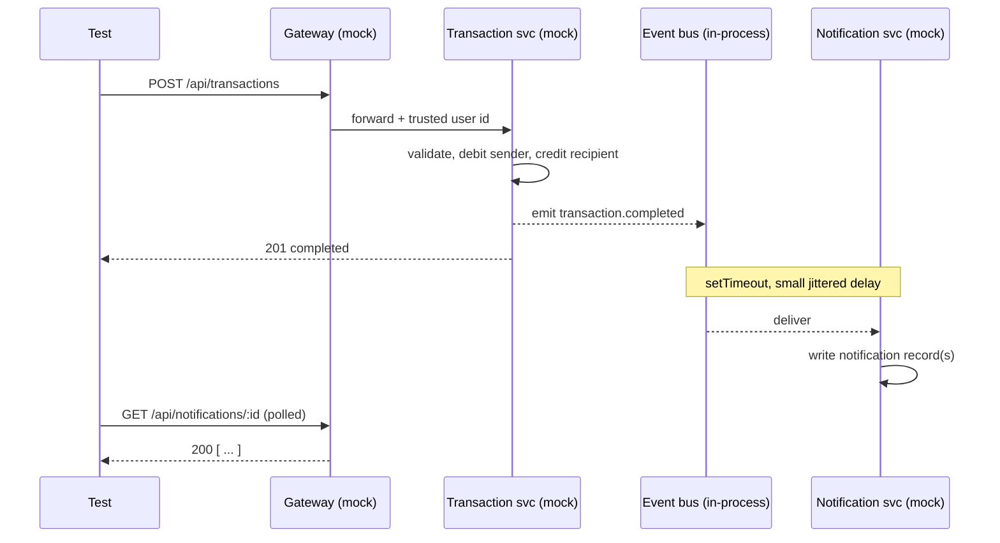

# Design

Test automation framework for a hypothetical fintech platform with a
microservices backend (User, Transaction, Notification services behind an API
Gateway). This document explains the approach and the decisions behind it. The
scenario catalogue with per test traceability is in
[`TEST-PLAN.md`](./TEST-PLAN.md).

---

## 1. Overview

### What the framework covers

| Area | Delivered |
|---|---|
| API tests | CRUD, error scenarios, data validation, authentication and authorization, idempotency |
| UI tests | registration flow, transaction flow, inline error validation (against a static mock frontend) |
| Test utilities | typed data factories, helpers, environment configuration, custom assertions |
| Reporting | HTML, JUnit, JSON, plus a per-failure request/response log and screenshots/traces |
| CI | one GitHub Actions job, zero manual setup |

### The system under test

The real system does not exist, so it is simulated in this repo:

- `mock-services/` is one Express app that provides all four backend components
  in process, plus a `/test/*` control plane for test setup. State lives in
  `Map`s; the "Redis" between the Transaction and Notification services is an
  in-process `EventEmitter`.
- `mock-frontend/` is a set of static HTML pages (registration, dashboard,
  new transaction) served by the same Express app at `/app`.

Money is stored and computed as integer minor units (cents) everywhere inside
the mock. It crosses the API as a decimal number.

---

## 2. Quality strategy

### Risk-based priority

Money movement is the point of the system, so a false pass on a transaction test
is the worst outcome. Priority order, reflected in the `@p0..@p3` tags:

| Priority | Concern |
|---|---|
| p0 | money correctness (amounts, balances, conservation), idempotency, authorization |
| p1 | input validation, async notification delivery, the two UI journeys |
| p2, p3 | ordering, deposit and withdrawal, limits, list shapes, framework self-checks |

### Test shape

```
        UI            few    2 journeys + inline error validation (Chromium)
   API / service      most   CRUD, validation, authz, rules, idempotency, errors
   Async delivery      few   notification eventual-consistency (own project)
```

### Where each concern is tested

| Concern | Layer | Example |
|---|---|---|
| field validation | API | `POST /api/users` with no email returns 400 and names the field |
| business rule | API | transfer above balance returns 422, both balances unchanged |
| idempotency | API | same `Idempotency-Key` twice creates one transaction |
| authorization | API | user A reading user B's transactions returns 403 |
| async delivery | notification | poll `GET /api/notifications` until the record appears |
| user journey | UI | register, land on the dashboard, see the opening balance |
| error UX | UI | a bad amount shows a specific inline message and does not submit |

---

## 3. System model (mock)

### Endpoints

| Method | Path | Auth | Notes |
|---|---|---|---|
| `POST` | `/api/auth/login` | none | `{ email }` returns `{ token, user }` (mock JWT, no password) |
| `POST` | `/api/users` | none | returns the created user with an opening balance |
| `GET` | `/api/users/:id` | bearer | self only; any other id returns 403, existence not disclosed |
| `POST` | `/api/transactions` | bearer | honours the `Idempotency-Key` header |
| `GET` | `/api/transactions/:userId` | bearer | self only |
| `GET` | `/api/notifications/:userId` | bearer | self only; populated asynchronously |
| `POST` | `/test/reset` | none | wipe all state (local and ci only) |
| `POST` | `/test/seed` | none | insert known users |
| `GET` | `/test/state` | none | full state dump for debugging |

Identity always comes from the verified JWT. A client-supplied `x-user-id`
header is stripped by the gateway middleware and never trusted.

### Error contract

Every non-2xx response is `{ error: { code, message, details? }, requestId }`.
Tests assert on `error.code` (stable), not `message` (human-facing).

| HTTP | code | trigger |
|---|---|---|
| 400 | `VALIDATION_ERROR` | missing or invalid field; `details[]` lists offenders |
| 401 | `UNAUTHENTICATED` | missing, expired, malformed, or tampered token |
| 403 | `FORBIDDEN` | acting on another user's resource |
| 404 | `NOT_FOUND` | unknown login email |
| 409 | `IDEMPOTENCY_CONFLICT`, `EMAIL_EXISTS` | key reused with a different body; duplicate email |
| 415 | `UNSUPPORTED_MEDIA_TYPE` | non-JSON write |
| 422 | `INSUFFICIENT_FUNDS`, `INVALID_RECIPIENT`, `LIMIT_EXCEEDED` | business rule failure |
| 500 | `INTERNAL_ERROR` | unexpected; still returns the envelope, never a stack trace |

### Async notification flow



**Why the mock delays delivery.** In the real system the transaction response
returns before the notification is written, because the event has to cross Redis
to the Notification Service. A synchronous mock would let a naive test read the
notification immediately and pass, then that same test would flake in CI once
real latency appeared. The mock's event bus keeps a small jittered delay so the
notification tests must handle eventual consistency: poll a read endpoint with a
timeout for arrival, and wait the full budget before asserting absence. The
rationale is repeated as a comment on `EventBusOptions.delayMs` and at the top of
`tests/notification/delivery.spec.ts`.

---

## 4. Framework architecture

### Technology

| Concern | Choice | Why |
|---|---|---|
| Language | TypeScript (ESM) | typed request and response contracts catch drift at author time |
| Runner and UI | Playwright Test | one tool for API and browser, with parallelism, retries, trace viewer, `webServer` auto-start, and an HTML reporter |
| Assertions | Playwright `expect` plus custom matchers | domain assertions read as intent |
| Mock services | Express and TypeScript | same language as the tests, trivial to run in CI |
| Data | `@faker-js/faker` and typed factories | unique-by-default identifiers make parallel runs safe |
| Validation | zod | runtime checking of request bodies and of the resolved config |
| Reporting | HTML, JUnit, JSON, list | HTML for triage, JUnit for CI, JSON for downstream tooling |
| CI | GitHub Actions | matches the assumed stack |

### Layout

```
mock-services/src/
  domain/       ledger, event-bus, notifications, errors
  auth.ts       JWT issue and verify
  middleware.ts request id, logging, auth guard, JSON guard, error envelope
  schemas.ts    zod request schemas
  app.ts        routes + /test control plane
  server.ts     listen entrypoint (npm run mock:start)
mock-frontend/public/   index, login, dashboard, transaction, app.js, styles.css
src/
  config/       local | ci | staging profiles, resolved by TEST_ENV, zod-validated
  clients/      types (the contract), http (transport + logging), api, control-plane
  factories/    user, transaction  (build() pure, create() persists)
  helpers/      poll (waitFor + sleep), tokens (forged JWTs)
  assertions/   matchers (toMatchErrorEnvelope, toEqualMoney, toBeIsoDateString)
  fixtures.ts   the test entry point
  global-setup.ts   one mock reset before the run
tests/
  api/          users, auth/authz, transactions (crud, validation, rules, idempotency), framework smoke
  notification/ delivery (eventual consistency)
  ui/           registration, transaction
```

### Layering

```
tests/*.spec.ts      intent only: given, when, expect
  uses  fixtures      inject a ready client, an authenticated user, a request log
  uses  clients/api   one typed method per endpoint
  uses  clients/http  transport: base URL, auth header, request/response logging
  reads config/env    the only module that knows environment specifics
```

### Test data

Two entry points per entity:

- `build(overrides?)` returns a valid request object with no I/O, for validation
  and negative specs.
- `create(...)` persists via the API (and logs in, for users) and returns the
  created record plus a token.

Identifiers are unique by default (`qa+<uuid>@test.local`), which is the primary
isolation mechanism for parallel runs.

### Environment configuration

`TEST_ENV` (default `local`) selects a profile. The resolved config is validated
by zod at startup, so a bad value fails before any test runs.

| Field group | Examples |
|---|---|
| endpoints | `apiBaseURL`, `uiBaseURL`, `mockServerPort` |
| timeouts | `expectTimeoutMs`, `asyncPollTimeoutMs`, `asyncPollIntervalMs` |
| execution | `retries` |
| flags | `startMockServer` (false for staging), `allowTestControlPlane` (false for staging) |
| shared constants | `jwtSecret`, `openingBalanceMinor`, `notificationDelayMs` |

### Custom matchers

| Matcher | Purpose |
|---|---|
| `toMatchErrorEnvelope(code, { field? })` | asserts status, `error.code`, non-empty message, `requestId`, and optionally that `details` names a field, in one call |
| `toEqualMoney(expected)` | compares decimals at cent precision, avoiding float noise |
| `toBeIsoDateString()` | asserts a parseable ISO-8601 timestamp |

### Reporting

- HTML report for humans; JUnit and JSON for machines; `list` for the console.
- Screenshots, video, and traces are captured on failure only.
- `src/clients/http.ts` records every request and response into a per-test log.
  A fixture attaches it to the report only when the test fails, with tokens
  redacted. Green runs produce no attachment.

---

## 5. CI

`.github/workflows/ci.yml` is one job: checkout, Node from `.nvmrc`, `npm ci`,
install Chromium, `npx playwright test` with `TEST_ENV=ci`, and upload the report
(HTML, JUnit, JSON) plus failure artifacts. The mock stack is booted by
Playwright's `webServer`, so there is nothing to stand up.
